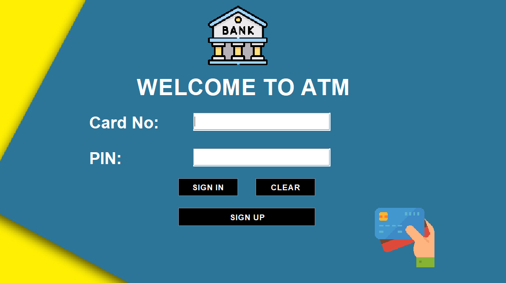
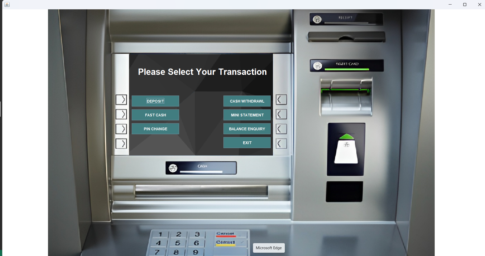
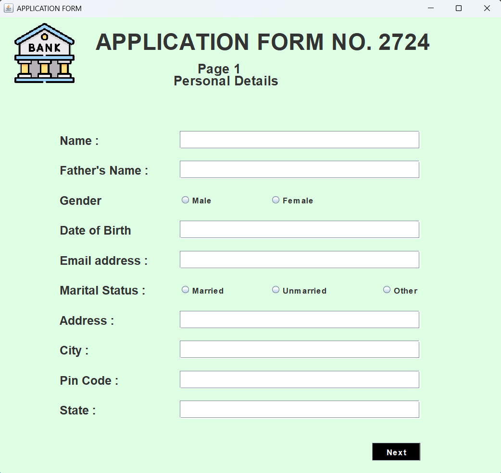

# Bank Management System

A Java Swing-based ATM simulation application that provides a complete banking interface with user authentication, account management, and transaction processing.

## Features

- **User Authentication**: Secure login with card number and PIN
- **Account Registration**: Multi-step signup process
- **Banking Operations**:
  - Deposit money
  - Cash withdrawal with balance validation
  - Fast cash (₹100 to ₹10,000)
  - Balance inquiry
  - PIN change
  - Mini statement
- **Database Integration**: MySQL for data persistence

## Prerequisites

- Java 8 or higher
- MySQL Server (for database functionality)
- MySQL JDBC Driver (mysql-connector-java.jar)

### MySQL JDBC Driver Installation

If you get `ClassNotFoundException: com.mysql.cj.jdbc.Driver`, download the MySQL Connector:

1. Download from: https://dev.mysql.com/downloads/connector/j/
2. Extract `mysql-connector-java-x.x.x.jar`
3. Run with classpath:
   ```bash
   java -cp ".;mysql-connector-java-x.x.x.jar" bank.management.system.Login
   ```

## Database Setup

1. Create MySQL database:
```sql
CREATE DATABASE bankSystem;
```

2. Create required tables:
```sql
USE bankSystem;

CREATE TABLE login (
    card_number VARCHAR(20),
    pin VARCHAR(10)
);

CREATE TABLE signup (
    formno VARCHAR(20),
    name VARCHAR(50),
    fname VARCHAR(50),
    dob VARCHAR(20),
    gender VARCHAR(10),
    email VARCHAR(50),
    marital VARCHAR(20),
    address VARCHAR(100),
    city VARCHAR(50),
    pincode VARCHAR(10),
    state VARCHAR(50)
);

CREATE TABLE signuptwo (
    formno VARCHAR(20),
    religion VARCHAR(20),
    category VARCHAR(20),
    income VARCHAR(30),
    education VARCHAR(30),
    occupation VARCHAR(30),
    pan VARCHAR(20),
    aadhar VARCHAR(20),
    scitizen VARCHAR(10),
    eaccount VARCHAR(10)
);

CREATE TABLE bank (
    pin VARCHAR(10),
    date VARCHAR(50),
    type VARCHAR(20),
    amount VARCHAR(20)
);
```

3. Update database credentials in `Connn.java`

## Installation

1. Clone the repository
2. Configure MySQL connection in `Connn.java` (update username/password)
3. Compile the project:
   ```bash
   cd src
   javac -cp . bank/management/system/*.java
   ```
4. Run the application:
   ```bash
   java -cp . bank.management.system.Login
   ```
   Or use the provided batch files:
   - `run.bat` - Full application with database
   - `run-test.bat` - Launcher with both database and demo modes

## Demo Mode (No Database Required)

For testing without MySQL setup:
1. Run `run-test.bat`
2. Click "Demo Mode (No Database)"
3. Use Card: 123, PIN: 456 for login
4. All features work except data persistence

## How to Run

### Option 1: Using Batch Files (Recommended)
1. Double-click `run-test.bat` in the project root
2. Choose your preferred mode:
   - **Demo Mode (No Database)** - Works immediately, no setup required
   - **Login with Database** - Requires MySQL setup

### Option 2: Command Line
```bash
cd Bank_Management_System/src
java -cp . bank.management.system.BankApp
```

### Option 3: Direct Login (Advanced)
```bash
cd Bank_Management_System/src
# For demo mode:
java -cp . bank.management.system.LoginTest
# For database mode:
java -cp . bank.management.system.Login
```

## Usage

### Demo Mode (No Database)
1. Click "Demo Mode (No Database)" from launcher
2. **Login Credentials**: Card: `123`, PIN: `456`
3. Explore all ATM features (data won't persist)

### Database Mode
1. Ensure MySQL is running and database is set up
2. Click "Login with Database" from launcher
3. **First Time**: Click "SIGN UP" to create new account
4. **Login**: Enter your card number and PIN
5. **Main Menu**: Select desired banking operation
6. **Transactions**: Follow on-screen prompts

## Project Structure

```
src/bank/management/system/
├── Login.java           # Main login interface
├── main_Class.java      # ATM main menu
├── Signup.java          # Registration page 1
├── Signup2.java         # Registration page 2
├── Signup3.java         # Account creation
├── Deposit.java         # Deposit functionality
├── Withdrawl.java       # Withdrawal functionality
├── FastCash.java        # Quick withdrawal
├── BalanceEnquriy.java  # Balance inquiry
├── Pin.java             # PIN change
├── mini.java            # Mini statement
└── Connn.java           # Database connection
```

## Screenshots

### Login Screen

*Secure login interface with card number and PIN authentication*

### Main ATM Menu

*Professional ATM-style interface with all banking operations*

### Account Registration

*Multi-step registration process for new users*


## Contributing

1. Fork the repository
2. Create feature branch
3. Commit changes
4. Push to branch
5. Create Pull Request

## License

This project is for educational purposes.
